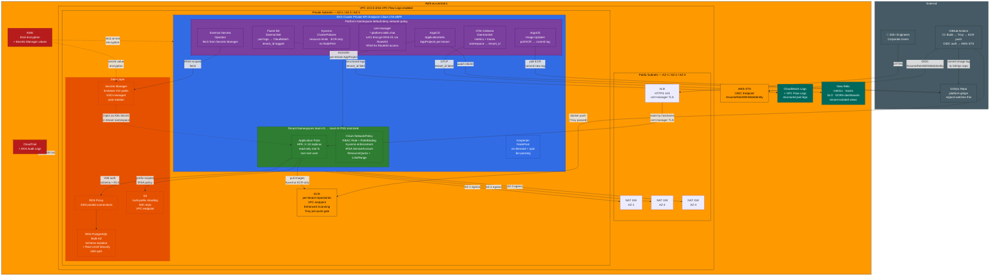

```mermaid
flowchart TB

    subgraph EXT["External"]
        Users["👥 250+ Engineers\nCorporate Users"]
        GHA["GitHub Actions\nCI: Build → Trivy → ECR push\nOIDC auth → AWS STS"]
        GitOpsRepo["GitOps Repo\nplatform-gitops\nargocd watches this"]
    end

    subgraph AWS["AWS eu-central-1"]
        STS["AWS STS\nOIDC Endpoint\nAssumeRoleWithWebIdentity"]
        KMS["KMS\nEtcd encryption\n+ Secrets Manager values"]
        CT["CloudTrail\n+ EKS Audit Logs"]

        subgraph VPC["VPC  10.0.0.0/16   VPC Flow Logs enabled"]

            subgraph PUB["Public Subnets — AZ-1 / AZ-2 / AZ-3"]
                ALB["ALB\nHTTPS 443\ncert-manager TLS"]
                NAT1["NAT GW\nAZ-1"]
                NAT2["NAT GW\nAZ-2"]
                NAT3["NAT GW\nAZ-3"]
            end

            subgraph PRIV["Private Subnets — AZ-1 / AZ-2 / AZ-3"]

                subgraph EKS["EKS Cluster   Private API Endpoint   Cilium CNI eBPF"]

                    subgraph PLATFORM["Platform Namespace   default-deny network policy"]
                        ArgoCD["ArgoCD\nApplicationSets\nAppProjects per tenant"]
                        ImgUpd["ArgoCD\nImage Updater\npoll ECR → commit tag"]
                        Kyverno["Kyverno\nClusterPolicies\nresource limits · ECR-only · no NodePort"]
                        CertMgr["cert-manager\n*.platform.talkit.chat\nLet's Encrypt DNS-01 via Route53\nIRSA for Route53 access"]
                        ESO["External Secrets\nOperator\nfetch from Secrets Manager"]
                        OTel["OTel Collector\nDaemonSet\nmetrics + traces\nnamespace → tenant_id"]
                        FB["Fluent Bit\nDaemonSet\npod logs → CloudWatch\ntenant_id tagged"]
                    end

                    subgraph TENANTS["Tenant Namespaces   team-01 … team-N   PSS restricted"]
                        PODS["Application Pods\nHPA: 2–10 replicas\nread-only root fs\nnon-root user"]
                        SEC["Cilium NetworkPolicy\nRBAC Role + RoleBinding\nKyverno enforcement\nIRSA ServiceAccount\nResourceQuota + LimitRange"]
                    end

                    KARP["Karpenter\nNodePool\non-demand + spot\nbin-packing"]
                end

                subgraph DATA["Data Layer"]
                    RDSP["RDS Proxy\n1000 pooled connections"]
                    RDS["RDS PostgreSQL\nMulti-AZ\nSchema isolation\n+ Row-Level Security\nIAM auth"]
                    S3["S3\nmulti-prefix sharding\n50K req/s\nVPC endpoint"]
                    SM["Secrets Manager\nhrs/team-XX/ paths\nESO-managed\nauto-rotation"]
                end

                ECR["ECR\nper-tenant repositories\nVPC endpoint\nEnhanced Scanning\nTrivy pre-push gate"]
            end
        end

        CWL["CloudWatch Logs\n+ VPC Flow Logs\nstructured pod logs"]
        NR["New Relic\nmetrics · traces\nSLO · DORA dashboards\ntenant-isolated views"]
    end

    %% ── Traffic ──────────────────────────────────────────────
    Users -->|HTTPS| ALB
    ALB -->|"route by hostname\ncert-manager TLS"| PODS

    %% ── CI/CD flow ───────────────────────────────────────────
    GHA -->|"OIDC\nAssumeRoleWithWebIdentity"| STS
    GHA -->|"docker push\n(Trivy passed)"| ECR
    GHA -->|"commit image tag\nto GitOps repo"| GitOpsRepo
    ImgUpd -->|"poll ECR\ncommit new tag"| GitOpsRepo
    ArgoCD -->|"watch HEAD"| GitOpsRepo
    ArgoCD -->|"reconcile\nper-tenant AppProject"| TENANTS

    %% ── Secrets ──────────────────────────────────────────────
    ESO -->|"IRSA-scoped\nfetch"| SM
    SM -.->|"inject as K8s Secret\nin tenant namespace"| PODS

    %% ── Data access ──────────────────────────────────────────
    PODS -->|"IAM auth\nschema + RLS"| RDSP
    RDSP --> RDS
    PODS -->|"prefix-scoped\nIRSA policy"| S3
    PODS -->|"pull images\nKyverno ECR-only"| ECR

    %% ── Observability ────────────────────────────────────────
    OTel -->|"OTLP\ntenant_id label"| NR
    FB -->|"structured logs\ntenant_id field"| CWL

    %% ── Encryption ───────────────────────────────────────────
    KMS -.->|"etcd at-rest\nencryption"| EKS
    KMS -.->|"secret value\nencryption"| SM
    CT -.->|"API audit trail"| AWS

    %% ── Egress ───────────────────────────────────────────────
    EKS -->|"AZ-1 egress"| NAT1
    EKS -->|"AZ-2 egress"| NAT2
    EKS -->|"AZ-3 egress"| NAT3

    %% ── Styling ──────────────────────────────────────────────
    classDef aws      fill:#FF9900,stroke:#232F3E,color:#000
    classDef eks      fill:#326CE5,stroke:#1a3fa8,color:#fff
    classDef platform fill:#7B3F9E,stroke:#4a1070,color:#fff
    classDef tenant   fill:#2E7D32,stroke:#1b5e20,color:#fff
    classDef data     fill:#E65100,stroke:#bf360c,color:#fff
    classDef obs      fill:#00695C,stroke:#004d40,color:#fff
    classDef security fill:#B71C1C,stroke:#7f0000,color:#fff
    classDef external fill:#455A64,stroke:#263238,color:#fff

    class AWS,VPC,PUB,PRIV,ECR,STS aws
    class EKS,KARP eks
    class PLATFORM,ArgoCD,ImgUpd,Kyverno,CertMgr,ESO,OTel,FB platform
    class TENANTS,PODS,SEC tenant
    class DATA,RDSP,RDS,S3,SM data
    class NR,CWL obs
    class KMS,CT security
    class EXT,Users,GHA,GitOpsRepo external
```
